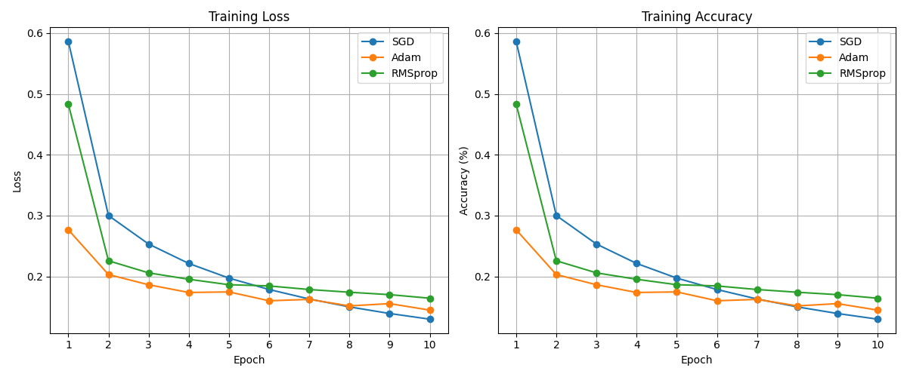

# 🧑‍💻 Training Optimization Playground 🎯

Welcome to **Training Optimization Playground**! This repository is an interactive space where we explore various **training optimizations** for neural networks. Whether you’re curious about how different optimizers perform or how to find the optimal learning rate for your models, this playground has something for you!

---

## 🚀 Project Overview

In this repository, we cover:
- 📊 **Optimizer Comparison**: Compare popular optimizers like `SGD`, `Adam`, and `RMSprop`.
- 🔍 **Learning Rate Finder**: Automatically find the best learning rate to speed up training without sacrificing accuracy.
  
The repository is organized into two parts:
1. **Optimizer Comparison** (`optimizer_comparison/`): Experiment with multiple optimizers and analyze their performance.
2. **Learning Rate Finder** (`find_optimal_lr/`): Identify the optimal learning rate for better training outcomes.

---

## 📂 Directory Structure

```
training-optimization-playground/
├── optimizer_comparison/
│   ├── resources/               # Contains all output files from optimizer experiments
│   │   ├── console_output.png    # Example console output from optimizer comparison
│   │   ├── metrics.png           # Comparison metrics for different optimizers
│   ├── utils.py                  # Helper functions (data loading, plotting)
│   ├── nets.py                   # Neural network models
│   ├── main.py                   # Script to run optimizer comparison experiments
├── find_optimal_lr/
│   ├── resources/                # Contains all output files from LR finder experiments
│   │   ├── learning_rate.png     # Learning rate vs loss/accuracy graph
│   │   ├── console_output.png    # Example console output from LR finding process
│   │   ├── metrics_comparison.png # Metrics comparison before/after optimal LR application
│   ├── find_lr.py                # Script to find optimal learning rate
│   ├── main.py                   # Script to demonstrate training with optimal LR
```

---

## 🛠️ Usage

### Optimizer Comparison

Run the optimizer comparison to see how `SGD`, `Adam`, and `RMSprop` perform on your dataset:

```bash
cd optimizer_comparison/
python main.py
```

The **console output** and **metrics** are automatically saved in the `resources/` folder.

#### Example Console Output:


#### Metrics Comparison:


---

### Learning Rate Finder

Use the learning rate finder to determine the best learning rate for your model:

```bash
cd find_optimal_lr/
python main.py
```

The **learning rate plot** and **console output** will be saved to the `resources/` folder.

##### Learning Rate Plot:


##### Example Console Output:


##### Metrics Comparison After Applying Optimal Learning Rate:


---

## 📊 Results and Visualization

- **Optimizer Comparison**: Visualize how different optimizers perform across multiple metrics, such as accuracy and loss, with graphs saved in the `resources/` folder.
- **Learning Rate Finder**: View the learning rate vs loss/accuracy plot to identify the best learning rate and compare metrics before and after applying it.

---

## Contributing

We welcome contributions! 🎉 Whether you're reporting bugs, suggesting new features, or submitting pull requests, your input is invaluable.
"""
